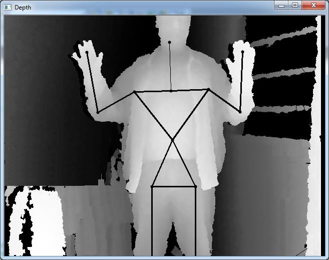
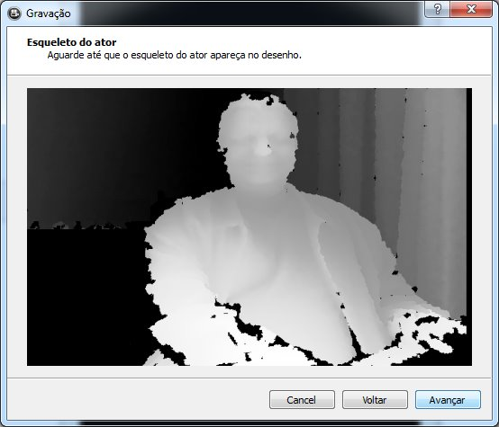
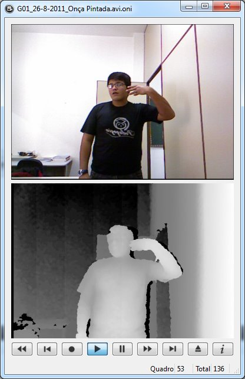
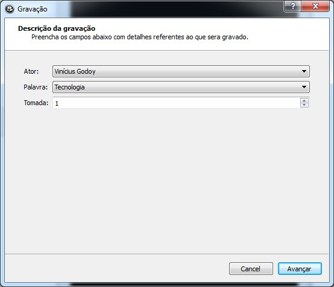

# Video recorder
Records video, depth and skeleton information using Microsoft Kinect or any OpenNI compatible device. 
Used to record this [Libras Movement Database](https://www.dropbox.com/sh/u38ptqo6q8r6s9d/AACSutfskrYp_PL1TdgNpogVa?dl=0). 

Dependencies:
- [XNCV](https://github.com/ViniGodoy/xncv)
- [OpenNI](https://github.com/OpenNI/OpenNI)

Project was created with QT 5, C++11 and QML 2.0.

This project is free. You may copy, redistribute or use just like you want. If you use in scientific research, please, 
give the credits and mention [my paper](https://ieeexplore.ieee.org/document/6984537/).

## Sample images

Recording interface with bone segmentation:

Recoding interface - no bones detected:

Playback RGB image and depth:

Image classification interface:

